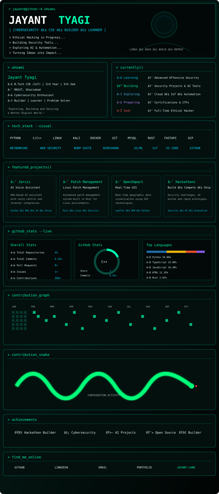

<!-- Main Cyberpunk Terminal Dashboard -->

  

<!-- Real-Time GitHub Stats -->

  
  

  

<!-- Live Animated Snake Graph -->

  

<!-- Quick Connect & Footer -->

  

> *"Same curiosity that breaks systems also builds a better, safer internet."*  
> — **Jayant Tyagi**

